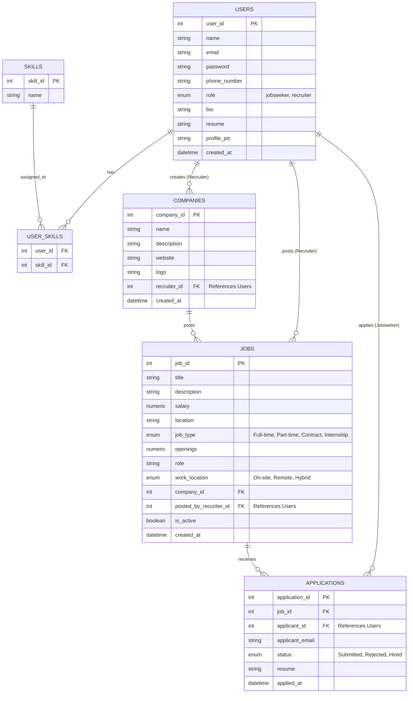
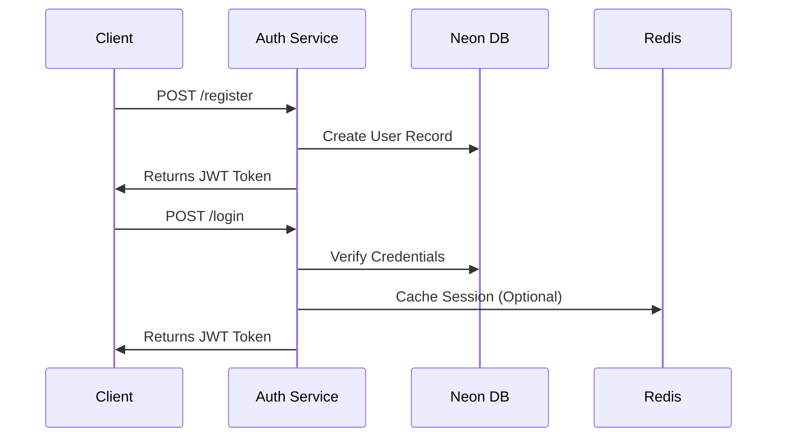
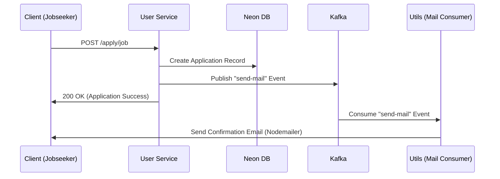
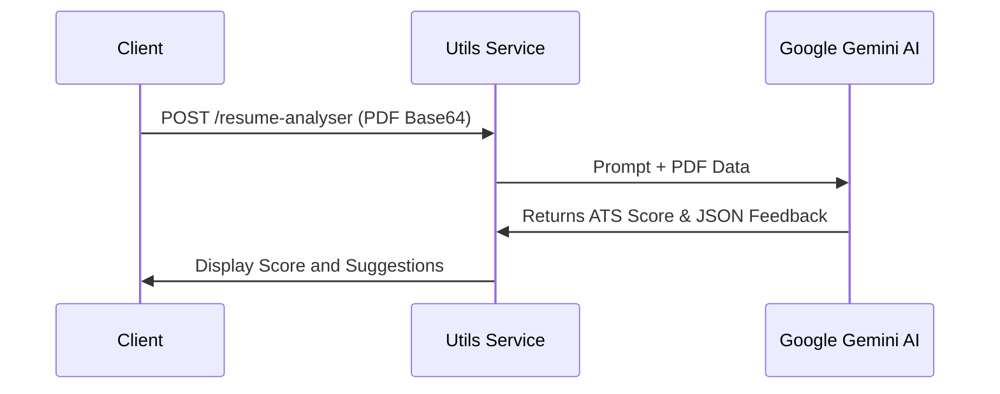

# AI-Powered Job Portal Platform

## Overview
This project is a modern, scalable Job Portal platform built using a microservices architecture. It provides a robust ecosystem for both **recruiters** (to manage companies and job postings) and **jobseekers** (to apply for jobs, manage their profiles, and get AI-driven career insights). It leverages an event-driven design to ensure decoupled and efficient background processing.

## Tech Stack
**Frontend:**
- **Framework**: Next.js 15+ (React 19)
- **Styling & UI**: Tailwind CSS, Radix UI, Shadcn UI
- **Icons**: Lucide React

**Backend (Microservices):**
- **Runtime**: Node.js with Express and TypeScript
- **Database**: Neon Postgres (Serverless PostgreSQL)
- **Caching**: Redis
- **Message Broker**: Kafka (via KafkaJS) for event-driven asynchronous communication
- **File Storage**: Cloudinary (for profile pictures, company logos, and resumes) with Multer

**AI & Third-Party Integrations:**
- **AI Capabilities**: Google Gemini GenAI (`@google/genai`) for parsing resumes and providing career advice.
- **Email**: Nodemailer (Triggered via Kafka events)

## Microservices Architecture

The backend is strictly divided into four distinct microservices, ensuring modularity and independent scalability:

1. **Auth Service**: Handles user registration, authentication, JWT generation, and role assignments (Jobseeker vs. Recruiter). Connects to Redis and Neon DB.
2. **Job Service**: Responsible for the employer side of the platform. Manages company profiles and job postings.
3. **User Service**: Handles the candidate side of the platform. Manages user profiles, skills, profile picture/resume updates, and job applications.
4. **Utils Service**: A utility/worker service handling:
    - **AI Resume Analyzer**: Extracts text from uploaded PDFs and communicates with Gemini to provide an ATS compatibility score and feedback.
    - **AI Career Advisor**: Takes a user's skills and suggests learning paths and job roles via Gemini.
    - **File Uploads**: Interfaces with Cloudinary.
    - **Email Worker**: Runs a Kafka consumer listening to the `send-mail` topic to dispatch background emails asynchronously.

---

## Data Diagram

---

## Core Workflows

### 1. User Registration & Auth Flow

### 2. Job Application & Event-Driven Email Flow

### 3. AI Resume Analysis Flow

